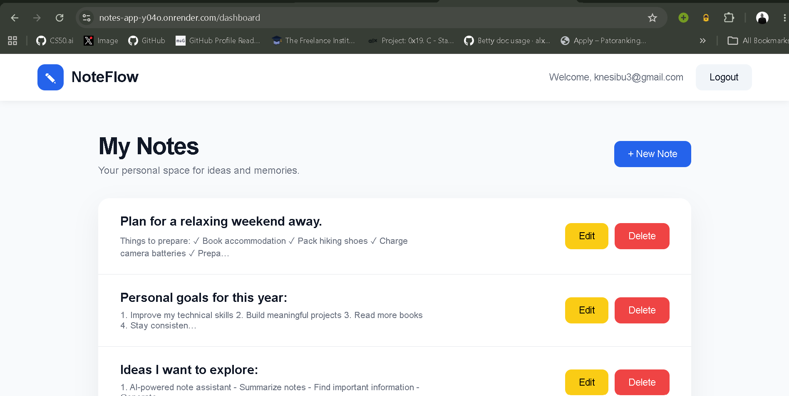

# NoteFlow ✎

A simple and elegant note-taking application that allows users to create, manage, and organize their personal notes in a clean workspace.

The goal of this project was to build a complete web application with user authentication, CRUD functionality, and deployment.

---

## Demo Video

🎥 Watch the application demo:

[Insert Demo Video Link Here]

---

## Screenshots

### Landing Page

<!-- Add screenshot here -->
<!-- Screenshot needed: The first page users see with the NoteFlow logo, description, and Login/Sign Up buttons -->


### User Dashboard

<!-- Add screenshot here -->
<!-- Screenshot needed: The dashboard showing the user's notes list and create note/logout buttons -->




### Creating a Note

<!-- Add screenshot here -->
<!-- Screenshot needed: The note creation page with title and content fields filled -->


### Viewing a Note

<!-- Add screenshot here -->
<!-- Screenshot needed: The page displaying a single note -->


---

# Features

## Authentication

- User registration
- Login system
- Logout functionality
- User-specific notes

## Notes Management

Users can:

- Create notes
- View notes
- Edit notes
- Delete notes

## Private Workspace

Each user has access only to their own notes.

---

# Tech Stack

## Backend

- Python
- Django

## Frontend

- HTML
- CSS

## Database

- SQLite

## Deployment

- Render

---

# Project Structure

```

notes_app/

│
├── notes/
│   ├── models.py
│   ├── views.py
│   ├── urls.py
│   └── migrations/
│
├── notes_main/
│   ├── settings.py
│   ├── urls.py
│   └── views.py
│
├── templates/
│   ├── landing.html
│   ├── dashboard.html
│   ├── login.html
│   ├── signup.html
│   ├── take_note.html
│   ├── edit_note.html
│   └── view_note.html
│
├── manage.py
├── requirements.txt
└── README.md

````

---

# Installation

Clone the repository:

```bash
git clone YOUR_REPOSITORY_URL
````

Move into the project folder:

```bash
cd notes_app
```

Create a virtual environment:

```bash
python -m venv env
```

Activate the virtual environment:

### Windows

```bash
env\Scripts\activate
```

Install dependencies:

```bash
pip install -r requirements.txt
```

Run database migrations:

```bash
python manage.py migrate
```

Start the development server:

```bash
python manage.py runserver
```

Open the application:

```
http://127.0.0.1:8000/
```

---

# How It Works

1. User creates an account
2. User logs in
3. User creates personal notes
4. Notes are saved and connected to the user's account
5. User can edit or delete their notes anytime

---

# Deployment

The application is deployed using Render.

Live Demo:

[Insert Live Website URL Here]

---

# Future Improvements

Planned improvements:

* Rich text editor
* Search functionality
* Better note organization
* Categories and tags
* Mobile application
* AI-powered note assistance
* REST API
* Modern frontend application

---

# Lessons Learned

Through this project, I practiced:

* Django project structure
* Database models and relationships
* Authentication systems
* CRUD operations
* User permissions
* Deployment workflow
* Writing documentation
